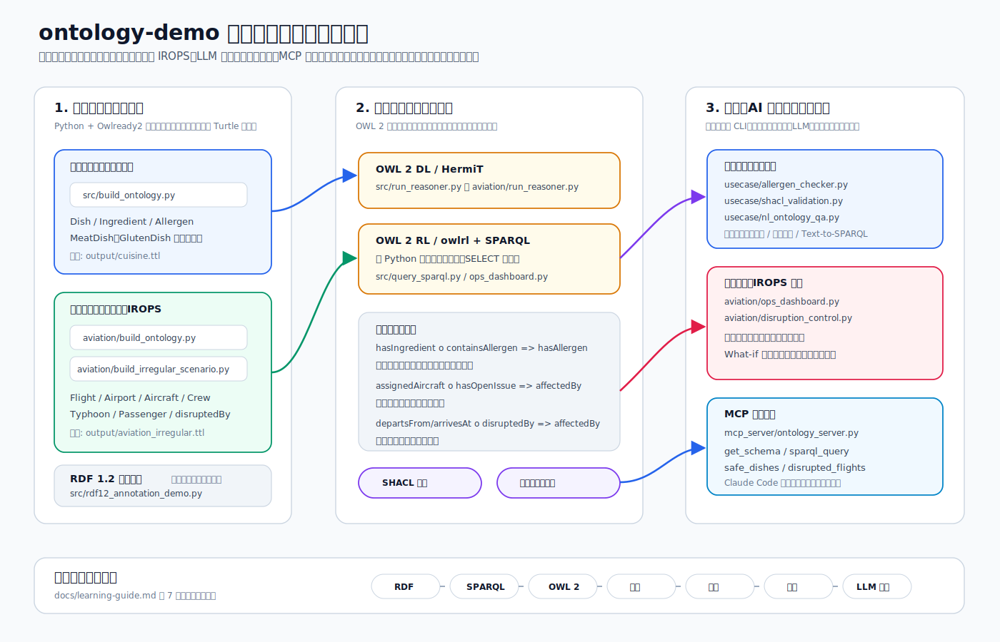

# オントロジー実装デモ（料理・食材・アレルゲン）

OWL 2 オントロジーを Python で構築し、**推論器による知識の自動導出**と **SPARQL による照会**を体験する最小デモです。題材は「料理・食材・アレルゲン」で、次のような推論が動きます。

- 親子丼は鶏肉（肉類）を含む → **肉料理（MeatDish）に自動分類**
- 親子丼は醤油を含み、醤油は小麦を含む → **親子丼は小麦アレルゲンを含む**（プロパティチェーン推論）



## 2026年時点の最新動向（このデモの背景）

- **RDF 1.2 が勧告候補（Candidate Recommendation）に到達**（2026年4月）。トリプル自体に出典や確信度を注釈できる「トリプルターム」（旧 RDF-star）が標準化の目玉です。[W3C ニュース](https://www.w3.org/news/2026/w3c-invites-implementations-of-rdf-1-2-concepts-and-abstract-data-model-and-rdf-1-2-semantics/)
- **SPARQL 1.2 は Working Draft 段階**（[Query Language](https://www.w3.org/TR/sparql12-query/) 2026年4月版、[Update](https://www.w3.org/TR/sparql12-update/) 2026年6月版など）。
- **LLM × オントロジー**が研究・実務の中心トピックに。LLM でオントロジー構築を加速する方向（[survey](https://www.sciencedirect.com/science/article/pii/S1570826825000022)、[LLMs4KGOE ワークショップ @ESWC 2026](https://koncordantlab.github.io/LLM4KGOE-ESWC/)）と、逆にオントロジーで LLM をグラウンディングしてハルシネーションを抑える方向（[神経記号アーキテクチャ](https://arxiv.org/html/2604.00555v2)）の両輪で進んでいます。
- Python 実装の定番は [Owlready2](https://owlready2.readthedocs.io/en/latest/)（0.51、HermiT/Pellet 推論器同梱）と [rdflib](https://rdflib.readthedocs.io/)（7.x）。本デモもこの 2 つ＋ [owlrl](https://pypi.org/project/owlrl/) を使います。

> 注: rdflib 7.6 は RDF 1.2 のトリプルターム構文（`<<( s p o )>>`）を未サポートのため、`rdf12_annotation_demo.py` では RDF 1.2 の書き方を提示しつつ、現行ツールで動く等価表現（RDF 1.1 reification）で実演しています。

## 構成

```
ontology-demo/
├── src/                          # 基礎デモ
│   ├── build_ontology.py         # ① オントロジー構築 (Owlready2) → OWL/Turtle 出力
│   ├── run_reasoner.py           # ② HermiT 推論器で自動分類・プロパティ値導出 (要 Java)
│   ├── query_sparql.py           # ③ SPARQL クエリ + OWL 2 RL 推論 (owlrl, Java 不要)
│   └── rdf12_annotation_demo.py  # ④ RDF 1.2 トリプルターム（ステートメント注釈）の紹介
├── usecase/                      # 実践ユースケース（飲食店のメニュー・アレルゲン管理を想定）
│   ├── allergen_checker.py       # ⑤ 顧客プロファイル別のメニュー適合性判定 CLI（推論を業務ロジックに）
│   ├── shacl_validation.py       # ⑥ SHACL による新規データの品質検証（閉世界の制約チェック）
│   └── nl_ontology_qa.py         # ⑦ LLM×オントロジー: 自然言語→SPARQL→グラウンディングされた回答
├── aviation/                     # 応用デモ: 航空オペレーション・オントロジー
│   ├── build_ontology.py         # ⑧ 便・機材・空港・乗務員・整備事象のモデル化
│   ├── run_reasoner.py           # ⑨ HermiT: 便の自動分類・整備事象の波及・機材繰りの推移閉包
│   ├── ops_dashboard.py          # ⑩ 運航管理(OCC)ダッシュボード: アラート/遅延波及/資格チェック
│   ├── build_irregular_scenario.py # ⑪ IROPS: 台風21号シナリオ (空港制限・乗務員繰り・旅客)
│   └── disruption_control.py     # ⑫ IROPS 統制ダッシュボード: What-if/波及経路/影響旅客
├── mcp_server/                   # MCP サーバー: Claude Code 等からオントロジーに接続
│   ├── ontology_server.py        # ⑬ 推論済み知識グラフ (航空+料理) をツールとして公開 (stdio)
│   └── test_client.py            # 動作確認用 MCP クライアント
├── docs/
│   └── learning-guide.md         # 体系的学習ガイド（RDF→SPARQL→OWL→推論→設計→運用→LLM の 7 段階）
├── output/                       # 生成物 (.owl / .ttl) — スクリプトが再生成
└── requirements.txt
```

## セットアップ

```bash
git clone https://github.com/bitpackman/ontology-demo.git
cd ontology-demo
python3 -m venv .venv
.venv/bin/pip install -r requirements.txt
```

- Python 3.9+ を想定（開発環境: 3.11 / Raspberry Pi OS）
- ②の HermiT 推論器のみ **Java 実行環境が必要**です（OpenJDK 17 で動作確認）。Java なしでも③の owlrl で同等の推論デモが動きます。

## 実行

```bash
.venv/bin/python src/build_ontology.py        # ① オントロジーを構築
.venv/bin/python src/run_reasoner.py          # ② HermiT で推論
.venv/bin/python src/query_sparql.py          # ③ SPARQL + OWL 2 RL
.venv/bin/python src/rdf12_annotation_demo.py # ④ RDF 1.2 注釈デモ
```

②の出力例（推論前後の比較）:

```
=== 推論前（明示的に書いた知識のみ） ===
  親子丼            型: [Dish]  アレルゲン: [なし]
  ...
=== 推論後（HermiT が導出した知識を含む） ===
  親子丼            型: [GlutenDish, MeatDish]  アレルゲン: [卵, 大豆, 小麦(グルテン)]
  天ぷらそば          型: [GlutenDish, SeafoodDish]  アレルゲン: [えび・かに, そば, 大豆, 小麦(グルテン)]
```

## 実践ユースケース（⑤〜⑦）

「飲食店のメニュー・アレルゲン管理」を題材に、オントロジーを業務に落とし込む 3 パターンです。①を実行して `output/cuisine.ttl` を生成してから試してください。

```bash
# ⑤ メニュー適合性チェッカー: 顧客の制限条件に合う料理を推論込みで判定
.venv/bin/python usecase/allergen_checker.py --avoid 小麦
.venv/bin/python usecase/allergen_checker.py --no-meat --avoid えび

# ⑥ SHACL データ品質検証: 不正な新規メニュー投入を違反レポートで検出
.venv/bin/python usecase/shacl_validation.py

# ⑦ LLM×オントロジー: 自然言語で知識グラフに質問（要 ANTHROPIC_API_KEY）
export ANTHROPIC_API_KEY=sk-ant-...
.venv/bin/python usecase/nl_ontology_qa.py "小麦アレルギーの人が食べられる料理は？"
.venv/bin/python usecase/nl_ontology_qa.py --offline   # API キーなしのデモ
```

- **⑤** は「醤油→小麦」のプロパティチェーン推論の結果を判定ロジックに使います。メニュー表に書かれていないアレルゲンを検出できるのがオントロジーの価値です。
- **⑥** は OWL（開世界・導出）と SHACL（閉世界・制約検証）の役割分担を示します。運用でのデータ受け入れ検証は SHACL の仕事です。
- **⑦** は Claude API（`claude-opus-4-8`・構造化出力）で自然言語を SPARQL に変換し、回答をクエリ結果のみにグラウンディングします。LLM のハルシネーション抑制にオントロジーを使う 2026 年の代表的パターンの最小実装です。

## 応用デモ: 航空オペレーション・オントロジー（⑧〜⑩）

架空の航空会社「青空航空」の 1 日の運航（便・空港・機材・機種・乗務員・整備事象・遅延）をモデル化した、より実務寄りのオントロジーです。

```bash
.venv/bin/python aviation/build_ontology.py   # ⑧ オントロジー構築
.venv/bin/python aviation/run_reasoner.py     # ⑨ HermiT で推論 (要 Java)
.venv/bin/python aviation/ops_dashboard.py    # ⑩ 運航管理ダッシュボード (Java 不要)
```

推論のハイライト:

- **整備事象の波及**: プロパティチェーン `assignedAircraft ∘ hasOpenIssue ⊑ affectedBy` により、「機材 JA802X に未解決の整備事象がある」という知識だけから **AZ141 便が影響便 (DisruptedFlight)** と自動分類されます
- **出発国・到着国・運航機種の導出**: `departsFrom ∘ locatedIn` などのチェーンで、AZ987（777 で羽田→那覇）が**国内線かつワイドボディ運航便**の両方に分類されます
- **機材繰りの遅延波及**: 推移的プロパティ `rotatesTo` で、天候遅延した AZ101 の下流レグ（AZ102・AZ103）を洗い出せます
- **乗務資格チェック（閉世界）**: `FILTER NOT EXISTS` により、777 運航便に A320 限定しか持たないパイロットが割り当てられている違反を検出します

⑩の出力例:

```
--- 1. 影響便アラート（整備・天候起因、推論による波及を含む） ---
  AZ101 羽田→伊丹 | 08:00 | 羽田の強風による出発遅延
  AZ141 羽田→シンガポール | 10:45 | エンジン防氷系統の点検未完了

--- 3. 乗務資格チェック（型式限定を持たない割当 = 違反） ---
  AZ141 羽田→シンガポール | 鈴木機長 | ボーイング777-300
```

### イレギュラー運航 (IROPS) 統制シナリオ（⑪〜⑫）

台風などのイレギュラー発生時は、影響が「空港 → 便 → 機材繰り → 乗務員繰り → 旅客」へ多段に波及します。⑪⑫は「台風21号が沖縄に接近し、那覇空港が運用制限に入った日」を構築し、この波及を推論で追跡する統制デモです。

```bash
.venv/bin/python aviation/build_irregular_scenario.py  # ⑪ 台風シナリオ構築
.venv/bin/python aviation/disruption_control.py        # ⑫ IROPS 統制ダッシュボード
```

- **空港制限の波及**: チェーン `departsFrom ∘ disruptedBy ⊑ affectedBy` / `arrivesAt ∘ disruptedBy ⊑ affectedBy` により、「那覇空港が台風で運用制限」という 1 トリプルから那覇発着便（AZ987・AZ988）が影響便に自動分類されます
- **What-if 比較**: 台風統制の有無で推論をやり直し、「新たに影響を受ける便」だけを差分表示。公理はそのまま、事実の付け外しでシナリオ比較できるのがオントロジーの強みです
- **2 系統の波及経路**: 機材繰り（`rotatesTo+`）に加え、**乗務員繰り**（`crewConnectsTo`）を追跡。機材は無関係でも、影響便から乗り継ぐ乗務員がいる AZ345 羽田→福岡が波及リスクとして検出されます
- **影響旅客の自動抽出**: `AffectedPassenger ≡ Passenger ⊓ ∃bookedOn.DisruptedFlight`。「影響便」の判定自体が推論結果なので、台風起因・整備起因を問わず要リブック旅客が推論の連鎖で洗い出されます

⑫の出力例:

```
=== 0. What-if 比較: 台風統制の発動前後 ===
  影響便 (台風なし): 2 便 → (台風統制発動後): 4 便
    + 新たに影響: AZ987 羽田→那覇
    + 新たに影響: AZ988 那覇→羽田

--- 2b. 波及リスク: 乗務員繰り (crewConnectsTo) 経由の下流便 ---
  AZ988 那覇→羽田 | AZ345 羽田→福岡 | 19:30

--- 3. 影響旅客（推論による自動抽出）と原因 ---
  伊藤様 | AZ987 羽田→那覇 | 台風21号(沖縄本島に接近中)
  佐々木様 | AZ141 羽田→シンガポール | エンジン防氷系統の点検未完了
```

## MCP サーバー: Claude Code からオントロジーに接続する（⑬）

推論済みの知識グラフを [MCP (Model Context Protocol)](https://modelcontextprotocol.io/) サーバーとして公開し、Claude Code などの AI エージェントからツールとして使えるようにします。エージェントがオントロジーを「外部の信頼できる知識源」として参照する構成で、⑦の Text-to-SPARQL をエージェント側から自然に行えます。

**マルチグラフ対応**: `aviation`（航空オペレーション・台風シナリオ）と `cuisine`（料理・アレルゲン）の 2 グラフを 1 サーバーで公開します。

| ツール | 対象 | 内容 |
|---|---|---|
| `get_schema(graph)` | 共通 | 語彙一覧（SPARQL を書く前に呼ぶ） |
| `sparql_query(query, graph)` | 共通 | 任意の SELECT/ASK（読み取り専用、更新系は拒否） |
| `disrupted_flights` / `propagation_risks` / `affected_passengers` | aviation | IROPS 定型分析（推論結果） |
| `alternate_airports(flight)` | aviation | **ダイバート先候補の推論**: 機種の必要滑走路長 × 空港の滑走路長 × 運用制限で候補を絞り、除外理由も返す |
| `simulate_airport_disruption(airport_codes)` | aviation | **What-if シミュレーション**: 任意の空港を運用制限にして再推論。以後の全ツールがシミュレーション状態で応答（`reload_graph` で解除） |
| `safe_dishes(avoid_allergens)` | cuisine | アレルゲン回避メニュー判定 |
| `reload_graph` | 共通 | ファイルから再読み込み・再推論 |

```bash
# 事前準備: グラフを構築しておく
.venv/bin/python src/build_ontology.py
.venv/bin/python aviation/build_ontology.py
.venv/bin/python aviation/build_irregular_scenario.py

# Claude Code に登録 (パスは環境に合わせる)
claude mcp add ontology-demo -- \
  $(pwd)/.venv/bin/python $(pwd)/mcp_server/ontology_server.py

# 接続確認
claude mcp list          # ontology-demo: ✔ Connected

# Claude Code なしでの動作確認
.venv/bin/python mcp_server/test_client.py
```

Claude Code から使う例（実際に動作確認済み）:

```
> もし台風が新千歳を直撃したら影響便はどう変わる？
  → simulate_airport_disruption(["cts"]): AZ103 が新たに影響、那覇便は解消、と差分報告

> AZ987 のダイバート先候補は？
  → alternate_airports("az987"): 777-300 は必要滑走路 2700m のため
    神戸(2500m)は除外、中部・羽田・伊丹・福岡などが候補。
    シミュレーション中なら制限中の空港も自動で除外される

> 小麦アレルギーの顧客に出せるメニューは？
  → safe_dishes(["小麦"]): 醤油経由の導出アレルゲンまで考慮して判定
```

- 決まった分析は専用ツールで確実に、探索的な質問は `get_schema` → `sparql_query` の 2 段で柔軟に答えられる設計です
- What-if は in-memory で行われ、ファイルは書き換えません。`reload_graph` でいつでも元のシナリオに戻ります

## 体系的に学ぶには

[docs/learning-guide.md](docs/learning-guide.md) に、本リポジトリを教材とした 7 段階の学習ガイド（RDF → SPARQL → OWL 2 → 推論 → 設計方法論 → 実務運用 → LLM 連携）をまとめています。各段階に W3C 仕様・教材・到達チェック・総合演習課題つき。

## このデモで学べる OWL 2 / SPARQL の機能

| 機能 | 使用箇所 |
|---|---|
| クラス階層・Disjoint 宣言 | `Meat ⊑ Ingredient`、肉/魚介/野菜/穀物は互いに素 |
| 定義クラス（必要十分条件） | `MeatDish ≡ Dish ⊓ ∃hasIngredient.Meat` → 個体の自動分類 |
| hasValue 制約 | `GlutenDish ≡ Dish ⊓ ∋hasAllergen.gluten` |
| プロパティチェーン | `hasIngredient ∘ containsAllergen ⊑ hasAllergen` |
| 逆プロパティ / Functional データプロパティ | `ingredientOf`、`calories` |
| 多言語ラベル | `rdfs:label`（ja / en） |
| タブロー法推論 vs ルールベース推論 | HermiT（②）と OWL 2 RL / owlrl（③）の比較 |
| SPARQL 1.1 プロパティパス・集計 | `hasIngredient/containsAllergen`、`GROUP_CONCAT`、`COUNT` |
| ステートメント注釈（RDF 1.2 の方向性） | ④ 出典・確信度をトリプルに付与 |
| 推論結果の業務ロジック活用 | ⑤ アレルゲン・食事制限によるメニュー判定 |
| SHACL によるデータ品質検証（閉世界） | ⑥ 新規データの受け入れ検証と違反レポート |
| LLM のグラウンディング（Text-to-SPARQL） | ⑦ 構造化出力による SPARQL 生成と結果限定の回答 |

## ライセンス

[MIT License](LICENSE)
